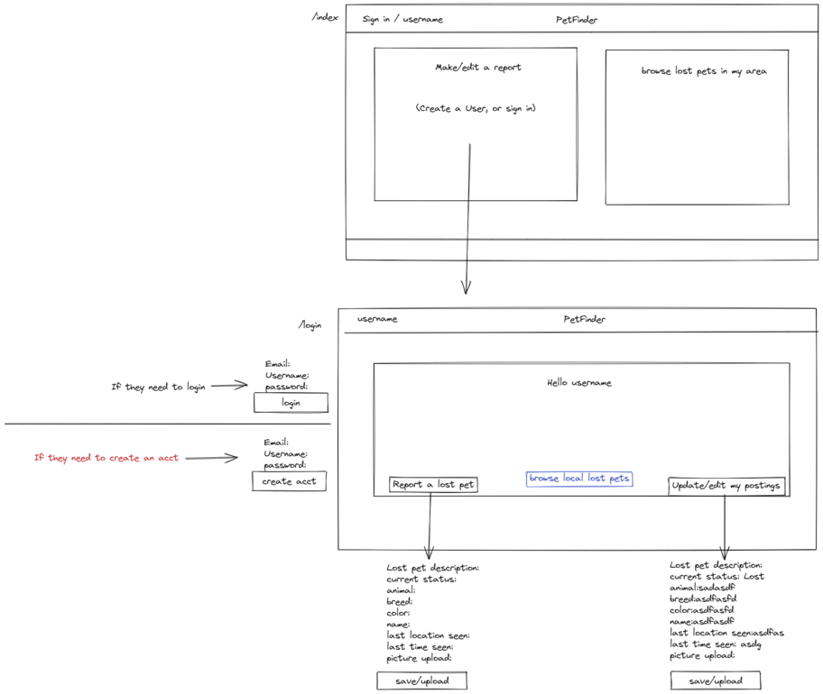

## Lost Pet Project

## License(s)

## table of contents
1. [Description](#description)
2. [Installation](#installation)
3. [Usage](#usage)
4. [Credits](#credits)
5. [License](#license)
6. [Questions](#questions)
        
        
        
## Description
Lost Pet Finder allows a USER to create an account and generate a listing of their current lost pet and display it in a page for local discovery. It allows other USERS to view current lost pets without an account.

The Motivation for building this project is a another resource for USERS to locally find their pets and view other lost pets, in collaboration to locate their pet. Gives the USER the option to fully describe their animal and last location spotted

This project solves the issue of not enough resources to locally find their pet when they go missing. It allows collaboration with other USERS and non USERS to locate their pet.

The knowledge gained from this project is collectivily utilization of NODE and EXPRESS while backed by MYSQL. To build routes using get and post requirements. Deploying on Heroku and using a new library or package. Building authentication for the site.
        
        
## Installation

        
        
## Usage

        
## Credits
Pablo Rosales, Bakary Sylla, Jeff Schmidt, Hayden Kiltoff

        
        

## Questions
You can access my github repository from here https://github.com/hayden1773
        
You may also forward an email for more information or questions to hayden060@gmail.com
        
## Features

        
        
## Tests 
